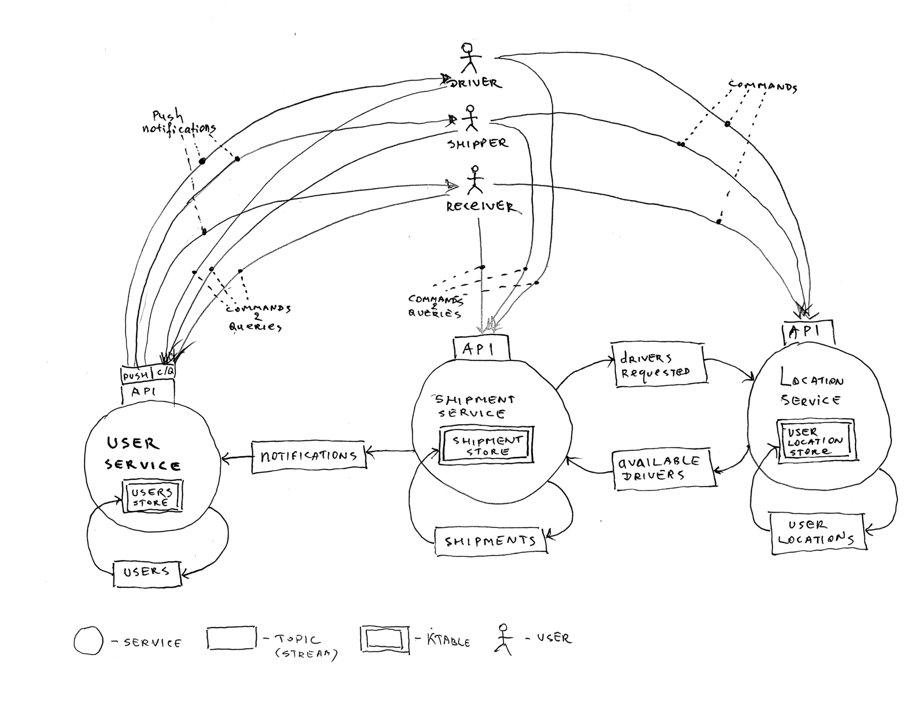

# DDD Sample App, take 2

This project is another take on the [DDD Sample App](https://github.com/citerus/dddsample-core)
that was originally built by nice people of [Citerus](https://citerus.github.io/dddsample-core/) 
and based on the famous shipping example that Eric Evans uses throughout 
[his book](https://www.amazon.com/Domain-Driven-Design-Tackling-Complexity-Software/dp/0321125215)
and his [online tutorials](https://elearn.domainlanguage.com).   

This sample app imagines a much smaller company. There is no legacy code (chance to write instant legacy?). 
The company wants to use the currently fashionable technologies to both take advantage of the evolved design approaches
and to attract talent wishing to work on a (green field) project using hip tools.

Feel free to contribute!

## FedUp - a local delivery service

FedUp is a hot last mile delivery startup. The business model is to offer an amazing customer
experience for local delivery to people fed up with FedEx/UPS/USPS. The startup is funded
by Peerless Shipping, the international container shipping company that decided to try its
hand in a local delivery market.

They plan to become profitable by getting their users pay a monthly membership and a reasonable 
per-delivery fee. 

They think they can tap into the same driver market that Uber and Caviar uses. They plan to
generously pay their freelance drivers for transporting packages between FedUp's happy customers.

#### How they are going to do it

To transport a package between a shipper and a receiver, FedUp plans to use local drivers. When a shipper
requests package pickup, the receiver is notified and arranges the place of delivery. After that,
a few drivers closest to the shipper are offered the gig. The first one to accept gets to pick up the package.  

After the pickup, the receiver is notified of the driver's ETA. The driver
takes the package to the specified location and hands it to the receiver, at which point the latter 
acknowledges package receipt, and the transaction is concluded.

There are some thoughts to optimize the routes so that the driver carries several packages at a time.    

They decided to start in Bay Area, offering same day, and sometimes same hour, service.

#### Technical needs
This is what they need to get started:

- a mobile app for the prospective users (both shippers and receivers) to enable them to
    - order a pickup
    - track package progress
    - be notified when they need to take action
    - make their location available between pickup request and pickup / delivery notification and delivery
    
- a mobile app for the concierges to enable them to
    - be notified when their action is requested
    - scan the package on receipt
    - collect the receiver's signature upon delivery
    - make their location available while they are working to optimize routes

Additionally, the need a centralized way to:    
- track locations of drivers, shippers and receivers to optimize routes and coordinate package hand-offs
- track handling events for every package to provide real-time state updates
- support the mobile apps by exposing a set of APIs they need

## Design goals
- design the application as a number of collaborating microservices, each fitting a bounded context
  of the problem it is responsible for solving. 
- decouple the services from each other by using events 
- make it very easy to deploy the services in containers to make horizontal scaling trivial. 
- write each service so that it can run on smallish boxes for inexpensive cloud deployment
- automate everything (CI/CD)
- use event streams as the source of truth

To accommodate these goals, here's the back-end stack (as of this moment):
- Kafka Streams both for inter-service communication and as event store, with CQRS in mind (where 
  eventually-consistent reads come from event-sourced views, and writes go into streams)
- Spring-boot, because it makes it easy to quickly develop applications and comes with everything
  and their mother (some say it comes with too much), including nice ways to expose our REST APIs
- Write everything in Kotlin because it is much nicer than Java, simpler than Scala and we love it.
  And because it's cool. Or at least because it's a modern strongly-typed language.
- Use Docker and some cloud provider        

## Current state of affairs
There are three independent applications that communicate via Kafka and expose REST endpoints for the client:
- Shipment service
  - This is the centerpiece of the application. It coordinates shippers, drivers and receivers 
    as they collaborate on shipping packages (shipments) across town. It does that by responding to clients' commands
    by publishing various events via Kafka to other services. Eventually, in response, these services publish
    events that Shipment service needs to move shipments along.  
  - It exposes three rest endpoints: for drivers, for shippers and for receivers. 
- Location service
  - responsible for tracking locations of the active users and transforming a stream of `nearby driver requests` 
    to a stream of `located drivers`
  - exposes a single REST endpoint. You can POST to it using the contents of `location/src/test/resources/location_reporting.http`     
- User service
  - responsible for user registration, notification, etc. Not quite thought through yet, just sketched out. At the moment, it's
    supposed to also deal with payments, but I think these need to move to another service: very different responsibilities.
    
    

#### How to build and run
- In order for the integration tests to work, you need Kafka broker and Zookeeper running on localhost (the services expect 
  Kafka broker on localhost:29092). Executing `docker-compose -f docker-compose.yml up` will start them up. However, I have not 
  been able to get my services to connect to the broker running in this container on my mac (using a machine-local setup).   
- to build, run `mvn clean install` in project root. This will produce 3 executable jars, one for each service. The jars are:
   - location/target/location-0.0.1-SNAPSHOT.jar
   - shipment/target/shipment-0.0.1-SNAPSHOT.jar
   - user/target/user-0.0.1-SNAPSHOT.jar
- they can be run as `java -jar location/target/location-0.0.1-SNAPSHOT.jar` from project root (substitute `location` 
  with the service name you want)
- at the moment, none of the services really do anything useful, partially because not much is implemented, and partially because of Kafka woes.
  You can report a location to the Location service (see above) and then see it published on a Kafka topic by running 
  `kafka-console-consumer --topic user-locations --from-beginning --bootstrap-server localhost:29092 --property print.key=true --property value.deserializer=org.apache.kafka.common.serialization.StringDeserializer`,  
  that's about it 
